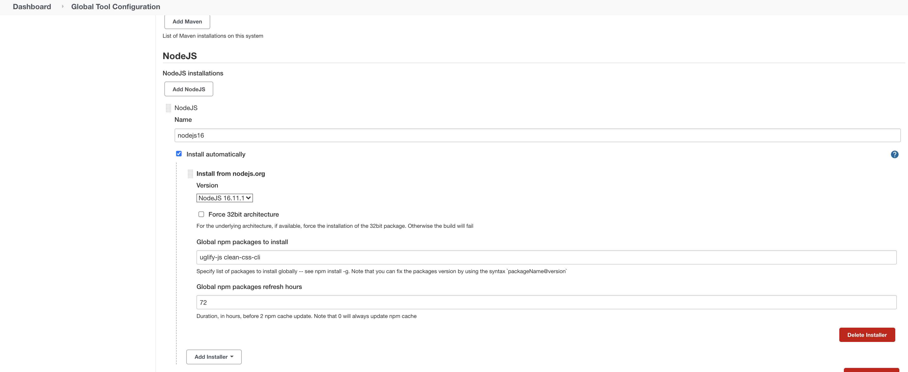

### 1. Create Jenkins VM:
##### install openjdk-8-jdk, Git
````sh
sudo apt-get install -y openjdk-8-jdk git
````
##### install Jenkins and enabling autostart
````sh
wget -q -O - https://pkg.jenkins.io/debian-stable/jenkins.io.key | sudo apt-key add - 
sudo sh -c 'echo deb https://pkg.jenkins.io/debian-stable binary/ > /etc/apt/sources.list.d/jenkins.list'
sudo apt-get update
sudo apt-get install -y jenkins 
sudo systemctl enable jenkins
sudo systemctl status jenkins
````
##### setup custom port 8081 for Jenkins 
Edit file /etc/default/jenkins `HTTP_PORT=8081`

````sh
sudo systemctl restart jenkins
````
##### check and install plugins: GitHub and Role-based authorization strategy


##### add new user: jenkins-NAME(your fullname)
User jenkins-iharadzinets created.

------------

### 2. Create Agent VM
##### install openjdk-8-jre, Git 
````sh
sudo apt-get -y install openjdk-8-jre git 
````
##### add SSH keys from master host to worker host
````sh
sudo adduser jenkins --shell /bin/bash
su jenkins
mkdir /home/jenkins/jenkins_worker1
mkdir ~/.ssh && cd ~/.ssh
nano ~/.ssh/authorized_keys  //input ssh id_rsa.pub key from master host
mkdir /var/lib/jenkins
chown jenkins:jenkins /var/lib/jenkins
````
##### connect agent to master node
Add node using ssh-key from id_rsa 


------------

### 3. Configure tools: NodeJS
##### Add NodeJS installations with version of NodeJS and global npm packages to install (uglify-js, clean-css-cli)

------------

### 4. Create “Multibranch Pipeline” pipeline job (work inside Lab folder)
````sh
Write Jenkinsfile which describes declarative pipeline
define NPM tools in pipeline section
Run in parallel stages for compressing JS, CSS files by using next utils:
Uglify-js www/js -> www/min
clean-css www/css -> www/min
create tar archive (ignore .git, css and js folders)
archive result
````


**[Check out Jenkinsfile](https://github.com/1volkman1/material-design-template/blob/master/Jenkinsfile "Check out Jenkinsfile")**
------------

### 5. Setup the GitHub webhook to trigger the jobs
Generate private token for Jenkins (Saved as "Secret text" in Jenkins credentials)


Creat a webhook in Github interface. Go to GitHub repository into Settings -> Webhooks -> Add Webhook


##### Enable ‘Poll SCM’ in Job settings
````sh
Add triggers `{ pollSCM('H/5 * * * *') }` 
````


##### Enable ‘GitHub hook trigger for Git SCM polling’
````sh
Add `githubPush()` to triggers section
````


--------------

------------

### 6. Use Scripted pipeline instead of declarative

**[Check out Jenkinsfile_scripted](https://github.com/1volkman1/material-design-template/blob/master/Jenkinsfile_scripted "Check out Jenkinsfile_scripted")**


